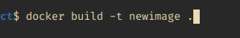
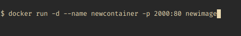

# Solving a text classification problem

## About the project:

This is a mid-term project for free machine learning course ([mlzoomcamp](https://github.com/alexeygrigorev/mlbookcamp-code)).
Thanks for an amazing course Mr. [Alexey grigorev](https://github.com/alexeygrigorev) and the entire [DataTalks.club](https://www.youtube.com/watch?v=wWBm6MHu5u8&list=PL3MmuxUbc_hIhxl5Ji8t4O6lPAOpHaCLR&index=1) teams.


### The problem:-
Multiclass text Classification

### The Dataset:- 
	./nepali_text_classification.csv

### Description:-
We will be using nepali text dataset to classify text. The dataset here used are taken from github.
There are three labels(sports, entertainment and business) and what we are doing is , using machine learning algorithms to predict and make an interface.


# To run the project

> We can run project in two different way. Running locally or running using docker container.

### Running locally

Type following things in a terminal or in a command prompt 
```python 
python predict.py
```
> Note: Now the program has run , you can visit to http://127.0.0.1:8000/docs and make a prediction.


### Running using docker

To run using docker, we have to go through some steps.
The steps are mentioned below:

**Building the docker image**

- To build the docker image we have to run following command
	- ``docker build -t <name_of_image>.``

	> docker build , will build the image.

	> -t: custom naming the project/image

	> the full stop at the end means , build in current directory.
	
-Example: 




**Running the docker container**

- To create and run the docker container, type following command in a command prompt or in terminal.
	- type ``docker run -d ---name <container_name> -p <desired_port>:80 <name_of_image>``

	> docker run will run the image

	> -d: means run in detach mode (does not show the details of what's going under the hood)

	> --name: giving container a name (if name already exists then it won't create the container if not it will create a new container with provided name)

	> -p: port, 80 is used to communicate with web and transfer web pages, we can custom provide a port to connect with the server.
	> and at the end we have to tell which image to run.

- Example



**Stop the running container**

- type ```docker container stop <name_of_container>/<id_of_container>```


**Start the stopped container**

- type ```docker start <container_id>/<container_name>```

**Remove the container/image**

- To remove container type ```docker rm <container_name>```
- To remove image type ```docker rmi <name_of_image>``


